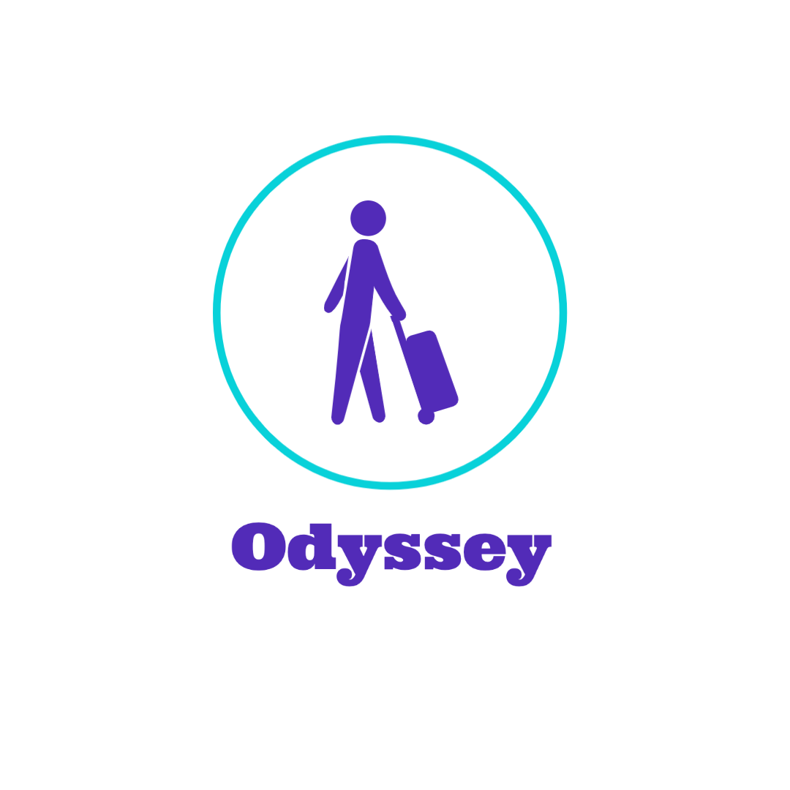

<!--

-->

<!-- webhook test -->

  <a href="https://odyssey.github.io">
      
    <h1 align="center">Odyssey</h1>
  </a>

Odyssey contains foundational UI components.

## Installation

## Development

## Contributing

The main purpose of this repository is deliverying easy-to-use, tourish experience in design system.

### Code of Conduct

Please read our Code of Conduct.

### Contributing Guide

Please read our contributing guide.

## License

[MIT](./LICENSE)
